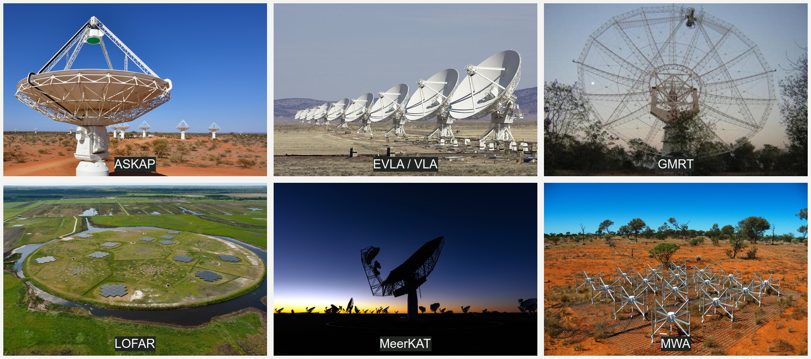

# facet self-calibration

`lofar_facet_selfcal`, or `facetselfcal` for short, is a command-line toolkit for direction-independent and direction-dependent (self-)calibration of radio-interferometric data. It supports calibration refinement of extracted datasets, full-field self-calibration, and extraction of regions of interest.

The workflows are used with data from LOFAR, MeerKAT, ASKAP, uGMRT, (E)VLA, and MWA observations. Processing details can vary by instrument and observing mode, so the instrument-specific notes below are a useful starting point.



*A selection of supported radio facilities. Image credits and licenses are listed in [`docs/assets/ATTRIBUTIONS.md`](docs/assets/ATTRIBUTIONS.md).*

## Capabilities

- Automated and configurable self-calibration cycles
- Direction-independent and direction-dependent calibration
- Full-field imaging and facet-based processing
- Extraction of regions of interest from larger fields
- HDF5 calibration-table utilities and diagnostic tools
- Support for LOFAR, MeerKAT, ASKAP, uGMRT, (E)VLA and MWA telescopes

## Installation

The current release requires Python 3.9 or newer. Install the latest source version directly from GitHub:

```bash
git clone https://github.com/rvweeren/lofar_facet_selfcal.git
cd lofar_facet_selfcal
python -m pip install .
```

Alternatively, install it without cloning the repository:

```bash
python -m pip install git+https://github.com/rvweeren/lofar_facet_selfcal.git
```

The software also requires the surrounding radio astronomy software stack used for LOFAR processing. A container with the standard LOFAR software is available from [FLoCs](https://tikk3r.github.io/flocs/). The container includes `facetselfcal`, so a local Python installation can be skipped when using that environment. This is highly recommended because it avoids the complicated installation of a large number of software packages.

Check the installation with:

```bash
facetselfcal --help
```

## Quick start

For an extracted LOFAR dataset, run automatic calibration with an extraction region:

```bash
facetselfcal \
	--auto \
	--imsize 1600 \
	-b your-ds9-extract-box.reg \
	-i your-image-name \
	your-extracted.ms
```

For a configuration-driven run:

```bash
facetselfcal --config your-config.txt your-extracted.ms
```

An example configuration is available at [`facetselfcal/data/example_config.txt`](facetselfcal/data/example_config.txt). Use `facetselfcal --help` to inspect all options.

## Typical workflow

1. Prepare a measurement set and, where needed, an extraction region.
2. Choose automatic settings or create a configuration file.
3. Run `facetselfcal` inside the appropriate FLoCs container.
4. Inspect the generated images, calibration tables, and diagnostics.
5. Use the supporting utilities for HDF5 tables, facet regions, source selection, or phase-difference analysis.

The [facet self-calibration overview](https://github.com/rvweeren/lofar_facet_selfcal/wiki/FACETSELFCAL-OVERVIEW) describes the extraction workflow in more detail.

## Instrument notes

### LOFAR

The package includes workflows for Dutch HBA and LBA baselines, international HBA baselines, wide-field processing, and decameter-band data. The exact settings depend on the observation and calibration strategy. See the [LOFAR HBA Dutch stations processing notes](https://github.com/rvweeren/lofar_facet_selfcal/wiki/LOFAR-HBA-Dutch-stations-processing) for instrument-specific guidance.

### MeerKAT

MeerKAT workflows cover UHF, L-band, and S-band data, including direction-independent and direction-dependent self-calibration. See the [MeerKAT processing notes](https://github.com/rvweeren/lofar_facet_selfcal/wiki/MeerKAT-processing).

### ASKAP

See the [ASKAP processing notes](https://github.com/rvweeren/lofar_facet_selfcal/wiki/ASKAP-processing) for instrument-specific guidance.

### uGMRT

See the [uGMRT processing notes](https://github.com/rvweeren/lofar_facet_selfcal/wiki/uGMRT-processing) for instrument-specific guidance.

### (E)VLA

See the [(E)VLA processing notes](https://github.com/rvweeren/lofar_facet_selfcal/wiki/VLA-processing) for instrument-specific guidance.

## Command-line tools

Installing the package provides these commands:

| Command | Purpose |
| --- | --- |
| `facetselfcal` | Run the main self-calibration workflow |
| `h5_merger` | Merge calibration HDF5 files |
| `ds9facetgenerator` | Generate facet regions for DS9 |
| `sub_sources_outside_region` | Extract a region from the LoTSS survey data |


## Citation

If you use this software or its extraction workflows for scientific work, please cite:

- van Weeren et al. (2021), *A&A*, 651, A115: [ADS record](https://ui.adsabs.harvard.edu/abs/2021A%26A...651A.115V/abstract)
- `facetselfcal` version 19.6.3, DOI [10.1051/0004-6361/202039826](https://doi.org/10.1051/0004-6361/202039826)

The machine-readable citation is available in [`CITATION.cff`](CITATION.cff).

## Contributing and support

Bug reports, feature requests, and contributions are welcome through the [GitHub repository](https://github.com/rvweeren/lofar_facet_selfcal). Please include the instrument, relevant software or container version, command/configuration, and a concise description of the observed behavior when reporting an issue.
